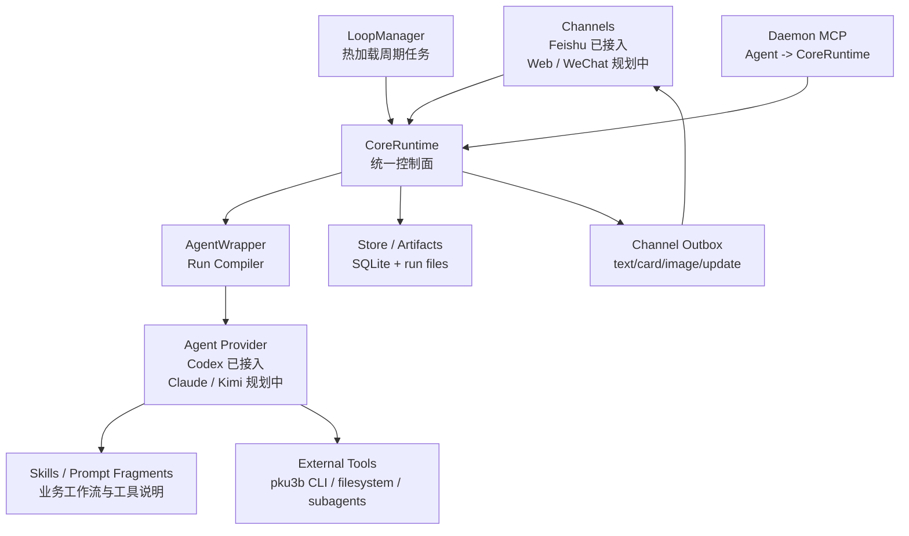

# PkuClaw 最新架构设计

PkuClaw 的目标形态是一个 **daemon-centered、multi-channel、self-configurable
study agent runtime**。它不是飞书 bot，不是 pku3b wrapper，也不是 Codex 专属
项目；它是一个常驻运行的学习 Agent runtime。

核心目标：让系统在保持可恢复、可审计、可回滚的前提下，最大化发挥 Agent 的自主
能力。Agent 不只是被动回答问题，还可以通过 daemon MCP 查询状态、修改 runtime
配置、添加/调整 loop、写 prompt/skill、并在完成任务后主动通知用户。

## 1. 总体拓扑



## 2. CoreRuntime

`CoreRuntime` 是 daemon 内部唯一的运行时中枢。它不是某个 channel，也不是某个
scheduler，而是所有入口和控制面的汇合点。

CoreRuntime 负责：

1. 接收 channel adapter 转换后的用户消息；
2. 处理本地控制命令，例如 mode/model/reasoning/status；
3. 创建 realtime run；
4. 接收 LoopManager tick，创建 loop run；
5. 实现 daemon MCP 工具的真实业务行为；
6. 查询和修改 live runtime config；
7. 管理 loop specs；
8. 根据 policy 决定 Agent 是否可以修改配置或发送通知；
9. 通过 channel adapter 发 text/card/image/update；
10. 写入 store、audit、run metadata、artifacts。

一句话：**CoreRuntime 是控制面；AgentWrapper 是执行编排层；Agent 是实际工作者。**

## 3. Channels

Channels 是面向用户的通讯适配器。Feishu 是当前实现，Web/WeChat 是规划目标。

当前统一接口定义在 `pkuclaw/channels/base.py`：

- `ChannelInboundMessage` / `ChannelEnvelope`：channel adapter 交给 CoreRuntime 的
  规范化入站事件；
- `ChannelTarget`：channel-neutral 的发送/更新目标；
- `ChannelOutboundBackend` / `ChannelOutbox`：CoreRuntime 后续统一下发
  text/card/image/update 的 outbox contract；
- `ChannelEventSinkFactory`：为 realtime run 创建 channel-specific `AgentEvent`
  renderer/sink。

Channel adapter 只负责：

- 平台 SDK/API 接入；
- 接收平台事件；
- 转换为统一 runtime message；
- 渲染 `AgentEvent`；
- 执行 CoreRuntime 下发的 send/update 操作。

Channel adapter 不应该：

- 直接选择 Agent；
- 直接读取/修改 runtime config；
- 直接管理 loop；
- 创建 Store、AgentWrapper、LoopManager 或 MCP server；
- 直接实现业务工作流。

## 4. Realtime Runs

Realtime run 是用户主动对话路径：

```text
Feishu/Web/WeChat message
  -> Channel adapter
  -> CoreRuntime.ingest_channel_message
  -> local control or create realtime run
  -> AgentWrapper builds prompt
  -> Agent provider executes
  -> AgentEvent stream
  -> Channel renderer updates user-facing UI
```

Realtime run 默认产生用户可见的 streaming reply。Feishu V1 使用 CardKit 创建并更新
同一张卡片。

调试 UI 时可以运行 raw Feishu realtime 路径：

```text
pkuclaw realtime feishu
  -> runtime bootstrap 构建 Store/RuntimeConfigStore/CoreRuntime/AgentWrapper
  -> 构建并注册 Feishu channel backend
  -> 不启动 daemon MCP server
  -> 不启动 LoopManager
  -> Feishu websocket 阻塞接收消息
```

这个路径仍然走 `CoreRuntime.ingest_channel_message` 和 `AgentWrapper` run
compiler；它只是关闭后台 loop 与 Agent -> CoreRuntime MCP 控制面，方便隔离
channel 渲染和实时对话问题。

## 5. LoopManager 与周期任务

LoopManager 是 CoreRuntime 拥有的 scheduler 组件。它只做调度，不做业务判断。
它通过 `CoreRuntime.create_loop_run` 与 `CoreRuntime.run_agent` 创建和执行 run，
不直接依赖或调用 `AgentWrapper`。

目标模型是多个热加载 loop specs：

```json
{
  "schema_version": 1,
  "loops": [
    {
      "id": "sync_notices",
      "enabled": true,
      "interval_seconds": 900,
      "prompt": "检查课程通知、作业和 DDL；没有重要变化则保持静默。",
      "skill_names": ["tasks/sync-notices.md"],
      "sink_mode": "silent",
      "notify_policy": "important_only",
      "prevent_overlap": true,
      "default_channel": "feishu",
      "default_target_type": "chat_id",
      "default_target_id": "oc_xxx"
    }
  ]
}
```

每次 tick 前 LoopManager 都应读取最新 loop specs。Agent 可以通过 daemon MCP 添加、
更新、启用、禁用 loop。loop run 默认 silent；只有 Agent 判断需要通知且 policy 允许
时，才通过 daemon MCP 发送消息。每个 enabled loop 拥有独立的 next-due 时间；调度器
用 worker pool 启动 loop run，因此一个长运行 loop 不应阻塞其他 loop。默认
`prevent_overlap=true`，同一个 loop 仍在 queued/running 时不会重复启动。

## 6. Daemon MCP

MCP 不属于 `channels/`。MCP 是 Agent 与 CoreRuntime 之间的内部控制协议。

推荐边界：

```text
Agent Provider
  -> MCP protocol server in pkuclaw/mcp
  -> tool handler
  -> CoreRuntime method
```

MCP 协议层只做 JSON-RPC/MCP 解析、tool schema 暴露和参数校验；真实能力归
CoreRuntime。MCP 层不能直接 import 或调用 Feishu backend；channel 工具必须走
`MCP -> CoreRuntime -> ChannelOutboundBackend`。

### 6.1 Channel tools

Channel tools 让 Agent 主动通知用户：

- `channel_send_text`
- `channel_send_card`
- `channel_send_image`
- `channel_update_card`

实现路径：MCP -> CoreRuntime -> channel adapter。

### 6.2 Runtime tools

Runtime tools 让 Agent 控制 daemon：

- `runtime_get_status`
- `runtime_get_config`
- `runtime_list_loops`
- `runtime_add_loop`
- `runtime_update_loop`
- `runtime_enable_loop`
- `runtime_disable_loop`
- `runtime_list_recent_runs`
- `runtime_get_run`
- `runtime_request_user_confirmation`

所有 runtime tool 都必须经过 policy、validation、backup、audit。

## 7. AgentWrapper

AgentWrapper 是 run compiler。它不应该直接承担 daemon 管理职责。
它只读取 runtime snapshot 来构建运行上下文，不负责 runtime 写入、loop 管理、
daemon MCP server 生命周期或 channel outbox 操作。

每次 run 前它负责：

1. hot-load live runtime snapshot；
2. 合并全局 runtime settings 和 conversation overrides；
3. 创建 run directory；
4. 写 `prompt.md`；
5. 注入 prompt fragments；
6. 注入 sub-skills 和依赖 skill；
7. 注入 daemon MCP tool 使用说明；
8. 选择 Agent provider；
9. 归一化 Agent events；
10. 写 result/stdout/stderr/metadata。

## 8. Agent Providers

Agent provider 是实际执行器。当前 provider 是 Codex。未来 Claude Code、Kimi Code
等 provider 应实现同一边界：

```text
execute(context, prompt, sink) -> AgentResult
```

Provider 内部可以有不同的 CLI/API/session/event 格式，但对 CoreRuntime 和 channels
输出统一的 `AgentEvent` / `AgentResult`。

## 9. Skills 与业务智能

Skills 是业务工作流层，不是 daemon 逻辑。Daemon/core 不应该写死“怎么做作业”、
“怎么读 PDF”、“怎么同步通知”。这些放在：

- task skills：`sync-notices`、`do-homework`、`write-notes`；
- tool skills：`pku3b-setup`、`data-parser`、`pdf-reader`；
- runtime skills：Codex subagent/coordinator 使用说明；
- prompt fragments：长期偏好、策略、课程上下文。

pku3b 是外部 CLI 工具，默认通过 skill 文档暴露给 Agent。除非未来明确引入
可审计 deterministic snapshot layer，否则不要把 pku3b 包成 daemon MCP tool。

## 10. 配置系统

配置分两类。

### 10.1 Boot config

`configs/config.toml` 是启动配置，包含 secret env、base paths、bind host/port 等。
它只在 daemon 启动时读取。Agent 默认不能修改 boot config。

### 10.2 Live runtime config

`configs/runtime/` 是热加载配置目录，包含：

```text
runtime.json    # 当前 source of truth；agent/provider/model/reasoning/loops/policy
loops.json      # future optional split for dynamic loop specs
skills.json     # future skill registry
prompts/        # prompt fragments
backups/        # automatic backups
```

短期可以继续以 JSON 为主，因为 JSON 严格、标准库可读、便于 schema validation。
YAML 可以作为未来人类编辑友好格式，但必须经过同样的 validation/fallback 流程。

### 10.3 安全加载与写入

每次 realtime run、loop tick、MCP runtime tool 调用前都应读取 live snapshot：

```text
read files -> parse -> validate -> merge defaults -> normalize -> RuntimeSnapshot
```

失败时：

```text
use last_valid snapshot
  else use immutable defaults
  record warning in logs/status/run metadata
```

写入时：

```text
load current -> validate new -> backup old -> write tmp -> fsync -> atomic rename -> audit
```

Agent 推荐通过 daemon MCP 修改 runtime 文件。直接编辑文件也允许，但下一次热加载必须
校验，失败则 fallback，保证 daemon 继续可运行。

当前实现由 `RuntimeConfigStore` 负责 `runtime.json` 的读写：读失败回退到
last-valid/defaults；写入前复制到 `configs/runtime/backups/runtime.<timestamp>.json`；
写入使用 `.tmp`、flush/fsync、atomic rename；CoreRuntime 在 Store 的
`runtime_changes` 表记录 actor/run_id/file/action/hash/diff/status。

## 11. Store、Artifacts 与 Audit

Store 持久化：

- conversations；
- runs；
- artifacts；
- channel messages；
- runtime change audit；
- future user confirmations/jobs/phases。

每个 run 的文件产物包括：

- `prompt.md`；
- `result.md`；
- `stdout.jsonl`；
- `stderr.log`；
- metadata。

Agent 修改 runtime、loop、prompt、skill 时应写 audit：actor/run_id/file/action/hash/diff/status。

## 12. 设计原则

1. CoreRuntime 保持唯一控制面。
2. Channels 只做通讯适配。
3. MCP 是 Agent -> CoreRuntime 的内部控制协议，不是 channel。
4. LoopManager 属于 CoreRuntime，只负责调度。
5. AgentWrapper 只做 run 编译和执行编排。
6. Agent provider 可替换。
7. Skills 承载业务智能。
8. Live config 文件化、热加载、可备份、可回滚、可审计。
9. Agent 能自我配置系统，但不能破坏 daemon 的可运行性。
10. 高风险操作必须经过 policy 和用户确认。

## 13. 落地顺序

1. 收敛 CoreRuntime 模块，让 channel ingress、loop ticks、MCP tools、run lifecycle 都走同一个控制面。
2. 让 LoopManager 成为 CoreRuntime-owned scheduler，并支持多个热加载 loop specs。
3. 将 runtime config 拆成 `runtime.json`、`loops.json`、`skills.json`、`prompts/`。
4. MCP 从 channel outbox tools 扩展为 channel tools + runtime control tools。
5. runtime config 写入增加 validation、backup、atomic write、audit。
6. 建立 channel adapter protocol 和 provider protocol。
7. 引入 skill registry 和 job/phase/confirmation 状态。
