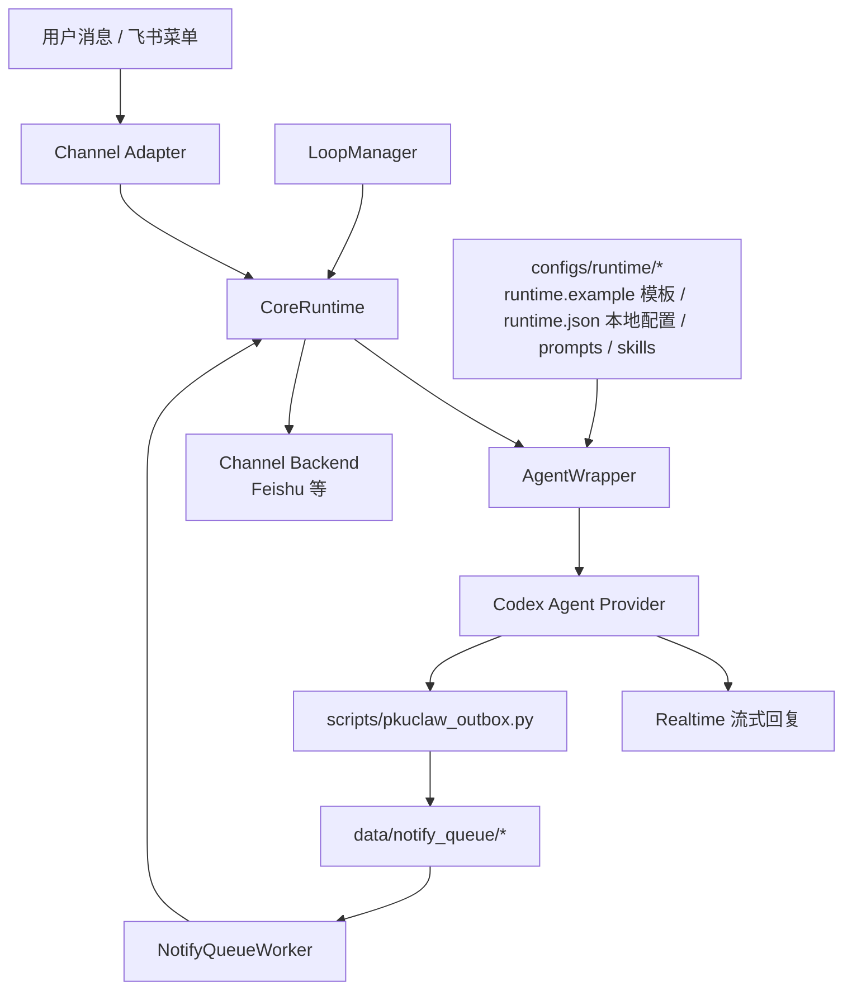

<div align="center">

# 🐾 PkuClaw

**将你的一切教学网事项都交给Agent**


PkuClaw 是一个面向 PKU 学习场景的 Agent。

它可以持续检查课程通知、作业 DDL、成绩变化，并且定期执行后台任务。 

把需要你关注的事项通过飞书、网页或其他渠道及时推送给你。

[](pyproject.toml)
[](docs-site/README.md)
[](LICENSE)

</div>

---

## ✨ 它是什么？

PkuClaw 是一个服务于 PKU 学习/课程场景的本地 Agent runtime。它不把业务逻辑硬编码进 daemon，而是把运行时配置、prompt、quick action 和 skill catalog 都放在可审计的文件中，让 Agent 在清晰边界内完成任务。

| 能力 | 说明 |
| --- | --- |
| 💬 **Realtime** | 用户消息或 quick action 触发，直接用中文流式回复。 |
| 🔁 **Loop** | `LoopManager` 定时运行后台任务；默认静默，只有重要变化才通知。 |
| 🧩 **Runtime Files** | `configs/runtime/**` 热加载，配置、prompt、skills 都能通过 Git diff review。 |
| 📮 **Channel Outbox** | Agent 只写 text/image/file 队列；daemon 负责目标解析和渠道投递。 |
| 🧱 **Thin Channels** | 飞书等 channel adapter 只处理平台事件、展示和发送，不承载业务逻辑。 |

## 🧭 当前架构



核心约束只有一句：**PkuClaw 只保留 `realtime` 和 `loop` 两类 Agent run**。Quick action 是 realtime 的配置化入口，不是第三类 run。

## 🚀 快速开始

### 1. 准备环境

```bash
git clone https://github.com/TheOne2006/PkuClaw.git
cd PkuClaw
uv sync
uv run pkuclaw --help
```

也可以使用标准 editable install：

```bash
python -m venv .venv
source .venv/bin/activate
python -m pip install -e .
pkuclaw --help
```

### 2. 创建本地启动配置

```bash
cp configs/config.example.toml configs/config.toml
cp configs/runtime/runtime.example.json configs/runtime/runtime.json
```

`runtime.json` 是本地热加载配置，可能包含飞书 `open_id`/`chat_id` 等目标标识，默认不提交。

如需启用飞书渠道，至少设置：

```bash
export FEISHU_APP_SECRET="你的飞书 app secret"
```

> `configs/config.toml`、真实 token、cookie、Open ID、日志和 `data/` 都不应提交。

### 3. 运行基础检查

```bash
python -m compileall pkuclaw scripts
python -m unittest discover
```

### 4. 启动运行时

```bash
# 开发实时入口：只启用 Feishu realtime 路径
uv run pkuclaw realtime feishu

# 完整 daemon：Feishu + CoreRuntime + loop + outbox queue worker
uv run pkuclaw daemon
```

## 🗂️ 配置地图

| 位置 | 类型 | 是否热加载 | 用途 |
| --- | --- | --- | --- |
| `configs/config.toml` | 启动期配置 | 否 | 数据目录、飞书凭据解析、Codex 默认配置、队列扫描间隔。 |
| `configs/runtime/runtime.example.json` | Runtime 模板 | 否 | 可提交的本地 runtime 配置模板。 |
| `configs/runtime/runtime.json` | Runtime 配置 | 是 | 本地热加载配置；默认 Git 忽略，可覆盖 Agent/Codex、loop、通知策略和投递目标。 |
| `configs/runtime/events.json` | Quick actions | 是 | 用户主动触发的 realtime 快捷任务。 |
| `configs/runtime/prompts.json` | Prompt 模板 | 是 | realtime/loop 的模型可见规则。 |
| `configs/runtime/skills.json` | Skill Catalog | 是 | runtime skill 元数据、依赖、适用 source 和确认边界。 |
| `configs/runtime/skills/**` | Skill 正文 | 是 | 课程同步、pku3b、outbox、PDF 等任务说明。 |

## 📚 文档导航

- [架构说明](ARCHITECTURE.md)：CoreRuntime、AgentWrapper、LoopManager、outbox 的边界。
- [开发说明](docs/DEVELOPMENT.zh.md)：中文开发约定、prompt/runtime 变更和验证要求。
- [文档索引](docs/README.zh.md)：仓库内文档的维护分工。
- [代码/文档差异报告](docs/DOC_CODE_GAPS.zh.md)：当前审计发现的已修复项和待决策 gap。
- [Runtime 文件说明](configs/runtime/README.md)：`configs/runtime/**` 的字段和行为。
- [文档站](docs-site/README.md)：Next.js + Fumadocs 文档站，本地预览和构建命令。
- [pku3b README](crates/pku3b/README.md)：PKU Blackboard / Portal raw JSON CLI。

## 🧪 开发与验证

普通代码改动至少运行：

```bash
python -m compileall pkuclaw scripts
python -m unittest discover
```

文档站改动还应运行：

```bash
cd docs-site
npm ci
npm run build
```

本仓库采用 `main + develop + topic branch + PR` 工作流。普通改动从 `develop` 切 topic branch，PR 默认合回 `develop`；`main` 只承接 release/hotfix。

## 🔐 安全边界

- Agent 不应直接接触或提交密钥、token、cookie、真实用户 ID。
- 提交作业、删除数据、安装系统包、清缓存、登录/登出等高风险动作必须先获得用户明确确认。
- Realtime 默认只回复当前对话；除非交付图片/文件，不额外发送 outbox text。
- Loop 默认静默；只有通知策略允许且确有重要变化时才通过 channel outbox 通知。
- Codex provider 当前示例配置使用 `danger-full-access`，仅适合可信本地环境；如需更严格沙箱，请同步检查 runtime 配置与任务能力边界。

## 🧱 目录结构

```text
pkuclaw/
  core/          # CoreRuntime、LoopManager、Store、共享模型
  runtime/       # runtime.json/events/prompts/skills 的热读 loader
  agents/        # AgentWrapper、Codex provider、事件 sink、artifact 摘要
  channels/      # Feishu 等平台 adapter/backend
  notify_queue/  # daemon 文件 outbox 队列 worker
scripts/         # pkuclaw_outbox.py 等 thin client
configs/runtime/ # 可热加载 runtime surface
docs-site/       # Next.js + Fumadocs 文档站
crates/pku3b/    # PKU Blackboard / Portal raw JSON CLI
```

## 📄 License

本项目使用 [MIT License](LICENSE)。
