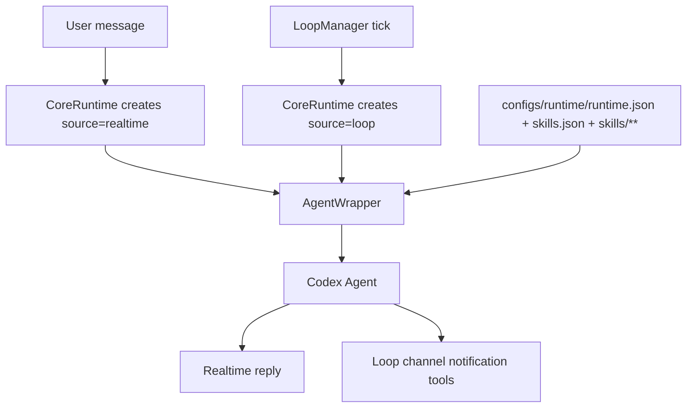

# PkuClaw

PkuClaw is a lightweight study-agent runtime for PKU workflows. It normalizes user messages and scheduled background checks into Agent runs, keeps runtime configuration in editable files, and uses channel notification tools when background loops need to notify the user.

## Current architecture

PkuClaw has exactly two Agent run sources:

- `realtime`: triggered by a user message. The Agent receives a minimal prompt and should answer the user directly in natural Chinese.
- `loop`: triggered by `LoopManager`. The Agent runs a configured background task, stays silent by default, and uses channel notification tools only when it finds important changes.

Runtime files are ordinary files under `configs/runtime/`:

```text
configs/runtime/
  runtime.json          # hot-loaded runtime config and loop specs
  skills.json           # skill catalog metadata
  skills/               # runtime skill markdown files
```

Agents may read and edit these files directly when the task calls for it. Runtime config is not managed through MCP tools.

## Skills

The skill source of truth is `configs/runtime/skills.json` plus `configs/runtime/skills/**`.

Prompt builders render only the Skill Catalog fields:

- `name`
- `description`
- `path`
- `dependencies`
- `allowed_sources`
- `requires_confirmation`

Skill markdown bodies are not injected by default. Realtime runs start with no suggested skills. Loop runs can list configured `skill_names` as suggested skills, but the Agent still reads the files by path when needed.

`sub-skills/` has been removed as a runtime skill source.

## MCP scope

MCP is reserved for loop-initiated user notifications. The available tools are:

- `channel_send_text`
- `channel_send_card`
- `channel_send_image`
- `channel_update_card`

Realtime prompts do not include MCP tools. Runtime read/write management tools are not exposed.

## Runtime flow



## Development

Install the package in editable mode and run checks from the repository root:

```bash
python -m compileall pkuclaw
python -m unittest discover
```

See `ARCHITECTURE.md`, `docs/DEVELOPMENT.zh.md`, and `configs/runtime/README.md` for more details.
