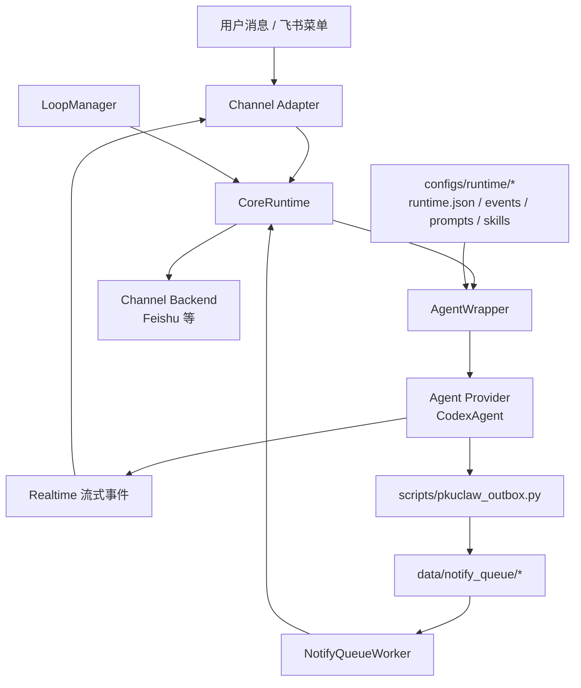

PkuClaw 的核心不是一个单纯聊天机器人，而是一个 **daemon-centered study-agent runtime**：

- 前面接入飞书等 channel；
- 旁边有 `LoopManager` 定时触发后台任务；
- 中间由 `CoreRuntime` 统一编排；
- 下游通过 `AgentWrapper` 构造 prompt 和运行上下文；
- 具体 Agent 由 `AgentProvider` 执行，目前默认是 `CodexAgent`；
- 后台通知不让 Agent 直连平台 API，而是写入本地 outbox 队列，由 daemon 投递。

## 总体运行图



这张图可以按四段读。

## 1. 前面：Channel Adapter 接平台事件

`Channel Adapter` 负责把平台原始事件归一化成 PkuClaw 内部消息。以飞书为例，adapter 需要处理：

- 普通用户消息；
- 菜单或卡片 action；
- 平台消息 id、sender id、open id、chat id 等 channel 上下文；
- 用于后续回复或通知的 `ChannelTarget`。

进入 `CoreRuntime` 之后，核心层不应该再关心飞书事件原始结构。

相关代码：

```text
pkuclaw/channels/base.py
pkuclaw/channels/feishu/*
```

## 2. 旁边：LoopManager 触发后台任务

`LoopManager` 是后台调度器。它不写课程业务逻辑，只做：

- 热读取 `runtime.json` 中 enabled 的 loop；
- 按 `interval_seconds` 调度；
- 避免同一个 loop 重叠运行；
- 调用 `CoreRuntime.create_loop_run()` 创建 `source = "loop"` 的 Agent run。

相关代码：

```text
pkuclaw/core/loops.py
pkuclaw/runtime/config.py
```

## 3. 中间：CoreRuntime 是统一控制面

`CoreRuntime` 负责把不同入口统一成 Agent run：

| 入口 | CoreRuntime 行为 | run source |
| --- | --- | --- |
| 普通用户消息 | `create_realtime_run()` | `realtime` |
| quick action | `create_realtime_event_run()` 后再进入 realtime | `realtime` |
| loop tick | `create_loop_run()` | `loop` |

`CoreRuntime` 不做自然语言意图分类，也不直接拼 prompt。它的职责是：

- 归一化请求；
- 创建 `AgentRunRequest`；
- 维护 channel target；
- 调用 `AgentWrapper.prepare()` 和 `AgentWrapper.run()`；
- 注册并调用 channel backend；
- 为 outbox 解析通知目标。

相关代码：

```text
pkuclaw/core/runtime.py
pkuclaw/core/models.py
```

## 4. 下游：AgentWrapper 和 AgentProvider 执行任务

`AgentWrapper` 把 `CoreRuntime` 的请求编译成一次可执行的 Agent run：

- 创建 run record；
- 热加载 runtime config、prompt templates、skill catalog；
- 根据 `source` 构造 realtime 或 loop prompt；
- 选择 provider；
- 保存 prompt、stdout、stderr、result 等 artifacts。

`AgentProvider` 是具体执行边界。当前默认 provider 是 `CodexAgent`。

相关代码：

```text
pkuclaw/agents/wrapper.py
pkuclaw/agents/base.py
pkuclaw/agents/providers/codex.py
```

## 5. 反向链路：Outbox 负责后台通知

loop 或少数需要交付文件/图片的 realtime run 不应让 Agent 直接调用飞书 API。Agent 只看到一个很小的本地脚本接口：

```text
scripts/pkuclaw_outbox.py text/image/file
```

脚本写入本地队列：

```text
data/notify_queue/pending/*.json
```

daemon 侧的 `NotifyQueueWorker` 读取队列，再交给 `CoreRuntime.send_channel_*()` 和 channel backend 投递。

相关代码：

```text
scripts/pkuclaw_outbox.py
pkuclaw/notify_queue/worker.py
pkuclaw/core/runtime.py
```

## 模块划分

```text
pkuclaw/
  core/          # CoreRuntime、LoopManager、共享模型、Store
  runtime/       # configs/runtime/* 的热读 loader
  agents/        # AgentWrapper、sink、artifact、providers/codex.py
  channels/      # Feishu 等平台 adapter/backend
  notify_queue/  # daemon 文件通知队列 worker
scripts/         # Agent 可调用的 thin client，例如 pkuclaw_outbox.py
configs/runtime/
  runtime.example.json
  runtime.json          # local, ignored
  events.json
  prompts.json
  skills.json
  skills/
```

## 设计边界

- 不新增第三类 run source。
- 不把 runtime 管理隐藏到数据库或 MCP 工具层里。
- 不在 prompt 中注入完整 skill markdown body。
- 不让脚本直连飞书或解析 target id。
- 不让平台细节泄漏到 core/runtime 层。

继续阅读 [请求生命周期](/docs/developer-guide/request-lifecycle)，按入口追踪一次任务如何运行。
